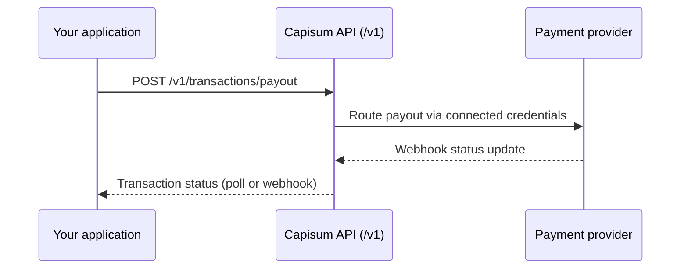

Capisum is a payment orchestration platform. You connect providers in the dashboard, define routing rules, and call the **public integrator API** at `/v1/*` to create and track payments.

<Warning>
  This documentation covers the **public API** (`/v1/*`, API key auth). Dashboard backend routes (`/api/v1/*`, JWT auth) are not documented here.
</Warning>

## What you can do today

| Capability | Public endpoint |
| --- | --- |
| Fincra payouts (NGN, GHS, KES) | `POST /v1/transactions/payout` |
| List and look up transactions | `GET /v1/transactions`, `GET /v1/transactions/ref/{reference}` |
| Poll payout status | `POST /v1/transactions/{id}/verify` |
| List supported provider slugs | `GET /v1/providers` |
| Check provider health | `GET /v1/providers/{slug}/status` |

## Base URL

| Environment | Base URL |
| --- | --- |
| Production | `https://api.capisum.com` |
| Local development | `http://localhost:3000` |

All public endpoints are prefixed with `/v1`. Authenticate with `Authorization: Bearer cps_...`.

## How it works

<Steps>
  <Step title="Connect Fincra in the dashboard">
    Add provider credentials at [app.capisum.com](https://app.capisum.com). This is not a public API operation.
  </Step>
  <Step title="Create an API key">
    Generate a staging or production key in the dashboard. Keys use the `cps_` prefix.
  </Step>
  <Step title="Call the public API">
    Use the key as a Bearer token against `/v1/*` endpoints.
  </Step>
</Steps>

<Columns cols={2}>
  <Card title="Quickstart" icon="rocket" href="/quickstart">
    Create your first staging payout.
  </Card>
  <Card title="Authentication" icon="key" href="/authentication">
    API keys and environment scoping.
  </Card>
  <Card title="API reference" icon="code" href="/api-reference/introduction">
    Shipped `/v1` endpoints and schemas.
  </Card>
  <Card title="FAQ" icon="circle-question" href="/guides/faq">
    Public API vs dashboard routes.
  </Card>
</Columns>
